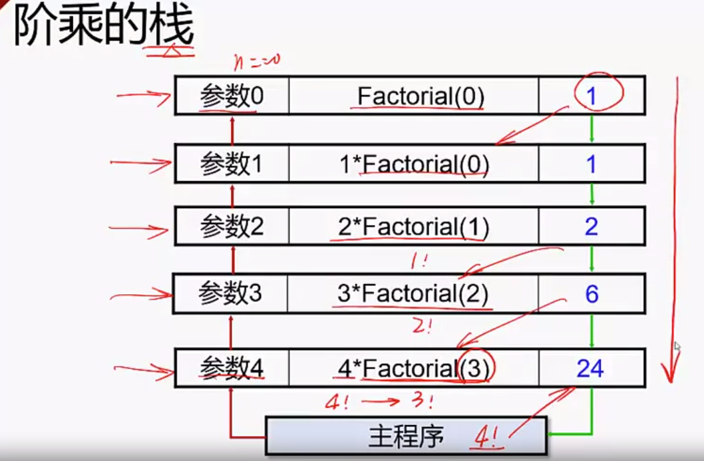

# 算法（Algorithm）


## 复杂度（Complexity）


* 语句频度T(n)

        一个算法中语句执行的次数称为语句频度,记为T(n)


### 时间复杂度（Time Complexity）

        算法中的基本操作语句的重复执行次数是问题规模n的某个函数，用T(n
        )表示，若有某个辅助函数f(n)，使得当n趋近于无穷大时，T(n)/f(n)的极限值为不等于零的常数，则称f(n)是T(n)的同数量级函数,记作T(n)=O(f(n)),称O(f(n))为算法的渐进时间复杂度，T(n)不同可能时间复杂度相同
        

* 常见时间复杂度
        
        常数阶O(1)
        对数阶O(log2n)
        线性阶O(n)
        线性对数阶O(nlog2n)
        平方阶O(n^2)
        立方阶O(n^3)
        k次方阶O(n^k)
        指数阶O(2^n)

### 空间复杂度（Space Complexity）


## 算法思想Thought

###  枚举 (Enumerration)
 * 概念
    
        把一个问题划分成一组子问题，依次对这些子问题进行求解，子问题之间是"横向的","同类的"关系
     
 
###  递推(Recurrence）

#### 动态规划(Dynamic Programming)

* 概念
     
1.      将待求解问题划分成若干个子问题
2.      子问题往往不是相互独立的
3.      不同子问题的数目常常只有多项式数量级
4.      将已解决的子问题答案进行保存，再需要时直接找出已求得答案，就可避免大量重复计算
* 基本步骤
1.      找出最优解的子问题结构
2.      根据子问题的结构建立问题的递归解式求解最优值
3.      以自底向上的方式求解最优值
4.      根据计算最优值时得到的信息，构造最优解
             
* 常见问题
    
-         最长公共子序列
-         矩阵连乘问题
```math
m[i:j]=\left\{\begin{matrix}
 &  & {0} &i=j \\ 
 &  & \min_{i<k<j}= &  &  i<j
\end{matrix}\right.
```

---


    


###  递归(Recursion）
* 概念


-      某个程序直接或间接的调用自身，求解问题的过程  
-       把一个问题逐级分解成子问题，依次对这些子问题进行求解，子问题之间是"纵向的"、"同类的"关系
      
```math
        f(x) =g(f(x))
```
      
* 递归要点
   
  
1.      递归式：原问题逐级划分成子问题
2.        递归出口：递归终止的条件，即最小子问题的求解，可以允许多个出口
3.         界函数：问题规模变化的函数，它保证递归的规模向出口条件靠拢
* 调用方式
  

-     直接调用
-     间接调用
* 递归栈



* 常见问题
   
-         棋盘分割问题
-         Hannoil汉诺塔问题
               1.源底座的n-1个盘子转移到中转底座
               2.源底座的最大盘子移到目标底座
               3.中转底座的n-1个盘子转移到目标底座
-       Fibonacci斐波那契数列


汉诺塔实现
```java
 void hanoi（int n, char src,char mid,char dest）{
     if(n==1){
        dest = src;
        return;
     }
     hanoi(n-1,src,dest,mid);
     dest = src;
     hanoi(n-1,mid,src,dest);
     return
 }
```


###  Divide and conquer （分治）

*  概念

        将规模为N的问题分解成规模为K的子问题，子问题之间相互独立且与原问题性质相同，求出子问题的解，就可得出原问题的解

* 步骤
1.      Divide
2.      Conquer
3.      Combine

###  probability （概率）


## 算法特征

### 有穷性(Finiteness)
### 确切性(Definiteness)
### 输入项(Input)
### 输出项(Output)
### 可行性(Effectiveness)

## 算法分类

### 基础算法

#### 排序算法(sort)
    
   * 按数据内外存交换分为内排序和外排序
   * 按排序册策略分为：插入排序、选择排序、交换排序、归并排序和分配排序
   
 #### 插入排序（Insertion sort）
     即将数组中的无序部分插入有序部分,当数组完全无序时，即将第一个数当作有序地处理
     
     * 无序数组插入排序
         * 1.将数组分为有序和无序两部分（即第一个元素为有序数部分，第2到n为无序数组）
         * 2.外层循环拿取插入元素key
         * 3.获取待比计较下标j与插入元素key对比进入内循环
         * 4.如果插入元素key小于待比较的有序元素arry[j]，则待比较元素整体后移一位
         * 5.直到插入元素key比待比较元素小为止,跳出内部循环
         * 6.插入元素插入该插入的位置
         * 7.外层循环移位取出下一个插入元素key，重复步骤3、4、5、6
     
     伪代码：
     for  j<-2 to  n
         key <- A[j]
         i<-j-1
         while  i > 0 and A[i] > key
             do A[i+1]<-A[i]
                 i<-i-1
         A[i+1]<-key   
         
#### 希尔排序
    即将数组用分治思想分成n/2个子数组，n不断缩小直至为1,不断为子数组排序
#### 冒泡排序
    
   * 概念：每遍历一次，将其中一个元素调整到最佳状态
   * 实现：两个for循环，第一个遍历次数，第二个比较次数
    
    
    最好情况时间复杂度：O(n)
    最坏情况时间复杂度：O(n^2)
    是否是稳定算法：稳定排序算法

#### 快速排序
    
    以基准点为分界，将乱序数组划分为两个数组，基准点左边元素小于基准点，基准点右边的元素大于基准点，对左右子数组递归调用；

#### 选择排序

#### 归并排序


#### 检索算法(search)
##### 二分查找
       * 1.验空
       * 2.定义左右边界数下标（）
       * 3.求中位数下标
       * 4.比较大小移动左右边界下标
       * 5.循环步骤3，4
       * 6.返回结果下标
##### 深度优先
##### 广度优先
##### 启发式搜索
##### 遗传算法

#### 加密算法（）

##### 加密算法分类
   * 对称加密算法
   * 非对称加密算法

##### RSA
##### DES

### 数据结构算法

### 数论与代数算法

### 计算几何算法

### 图论算法


## 常用设计模式

### 分治法
### 回溯法
### 动态规划
### 贪婪算法
   * 设计册率略：时间段的先做
   
   * 思想：根据时间从短到长依次排列完成任务
     
### 线性规划


## 实现实现方式

### 递归算法
### 迭代算法

## 算法评定

### 时间复杂度
### 空间复杂度
### 正确性
### 可读性
### 健壮性

